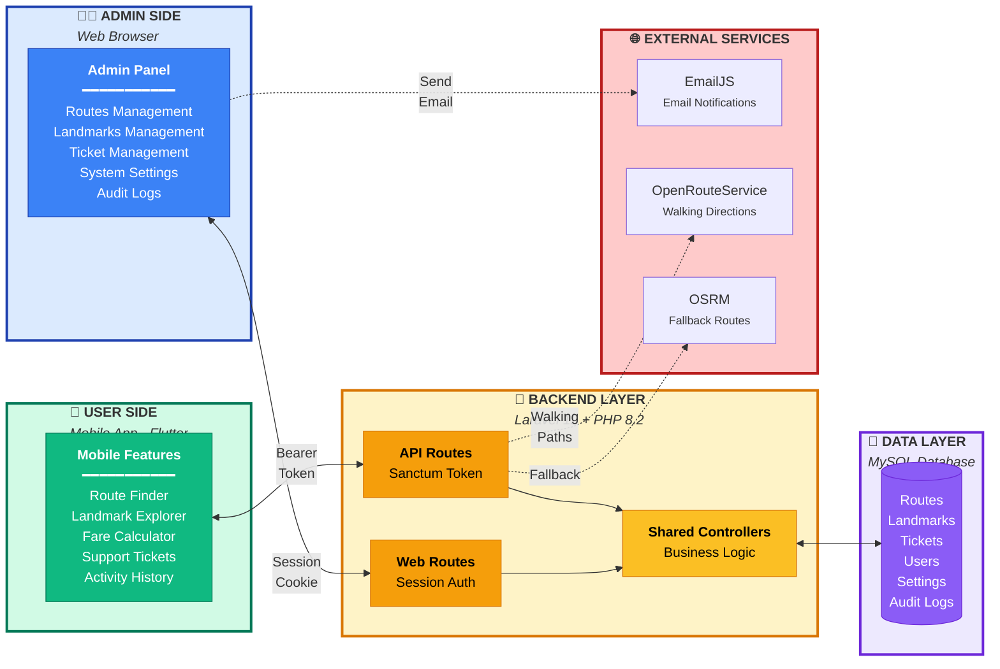
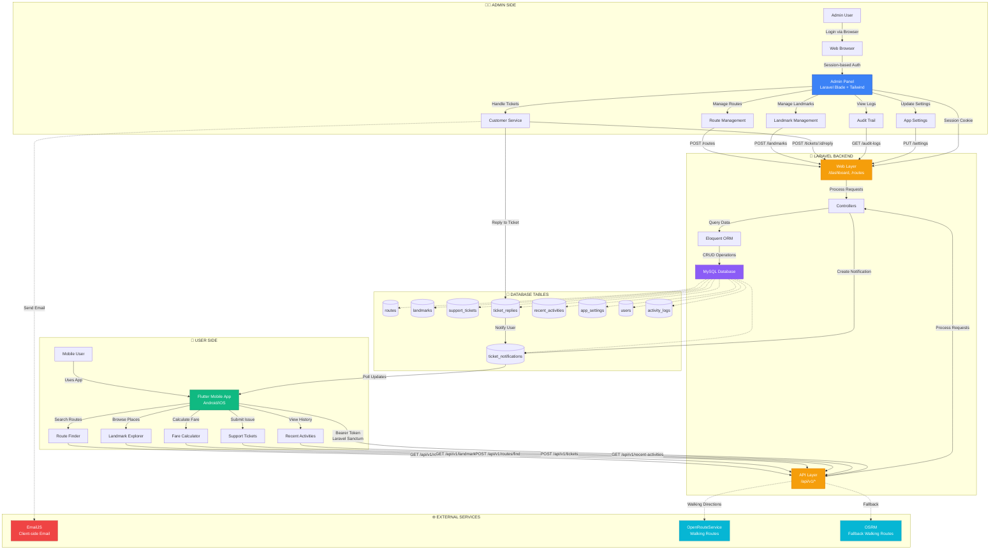
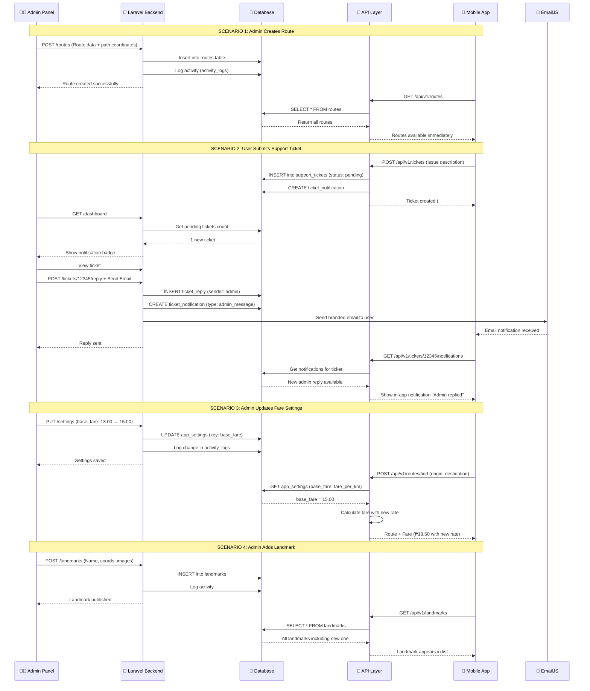

# LeJeepney System - Admin & User Interaction Diagrams

> **For PowerPoint Presentation**  
> These diagrams illustrate how the admin panel and mobile app interact through the Laravel backend.

---

## Diagram 1: High-Level System Architecture

**Use this for:** Initial overview slide showing the big picture

### Key Points:

- **Admin Side**: Web-based panel with session authentication
- **User Side**: Flutter mobile app with token-based authentication
- **Backend**: Shared Laravel backend serving both web and API routes
- **Database**: Single MySQL database storing all system data
- **External Services**: EmailJS for notifications, OpenRouteService/OSRM for routing

---

## Diagram 2: Detailed Component Architecture

**Use this for:** Technical architecture slide showing all components

### Database Tables:

- **routes**: Jeepney route data with path coordinates
- **landmarks**: Points of interest with images and descriptions
- **support_tickets**: User-submitted help requests
- **ticket_replies**: Admin/user conversation threads
- **ticket_notifications**: Real-time notification queue
- **recent_activities**: User activity history
- **app_settings**: System configuration (fares, etc.)
- **users**: Admin and mobile user accounts
- **activity_logs**: Admin action audit trail

---

## Diagram 3: Interaction Sequence Flows

**Use this for:** Demonstrating specific use cases and data flow

### Key Scenarios:

1. **Route Management**: Admin creates routes → Immediately available to mobile users
2. **Support Tickets**: Bidirectional communication with email notifications
3. **Settings Update**: Admin changes fare rates → Applied to all new calculations
4. **Content Publishing**: Admin adds landmarks → Real-time sync to mobile app

---

## Authentication Architecture

### Admin Panel (Web)

- **Method**: Session-based authentication with cookies
- **Guard**: Laravel `web` guard
- **Role**: Only users with `role = 'admin'` can access
- **Storage**: Database sessions table
- **Middleware**: `['auth', 'admin']`

### Mobile App (API)

- **Method**: Token-based authentication with Laravel Sanctum
- **Token Type**: Personal Access Token
- **Expiry**: 30 days (configurable)
- **Role**: Only users with `role = 'user'` can login
- **Rate Limit**: 60 requests per minute

### Role Separation

- Admin accounts **cannot** login via API (403 Forbidden)
- User accounts **cannot** access web panel (redirected to login)
- New admins can only be created by existing admins
- `role` field is protected from mass assignment

---

## How to Use These Diagrams in PowerPoint

### Method 1: Screenshot (Easiest)

1. Open this file in VS Code or GitHub
2. The diagrams will render automatically
3. Take screenshots and paste into PowerPoint

### Method 2: Mermaid Live Editor

1. Visit https://mermaid.live
2. Copy the Mermaid code from this file
3. Export as PNG or SVG
4. Insert into PowerPoint

### Method 3: VS Code Extension

1. Install "Markdown Preview Mermaid Support" extension
2. Preview this file (Ctrl+Shift+V)
3. Right-click diagram → Copy Image
4. Paste into PowerPoint

---

## Technology Stack Summary

| Layer               | Technology                              | Purpose                   |
| ------------------- | --------------------------------------- | ------------------------- |
| **Admin Frontend**  | Laravel Blade, Tailwind CSS, Leaflet.js | Web-based admin panel     |
| **Mobile Frontend** | Flutter (Dart), Provider, flutter_map   | Cross-platform mobile app |
| **Backend**         | Laravel 12, PHP 8.2                     | REST API + Web routes     |
| **Database**        | MySQL 8.0+                              | Data persistence          |
| **Authentication**  | Laravel Sanctum (API), Sessions (Web)   | Secure access control     |
| **External APIs**   | OpenRouteService, OSRM, EmailJS         | Walking routes, email     |

---

## Data Synchronization

### Real-Time Updates

- **Support Tickets**: Mobile app polls `/api/v1/tickets/{id}/notifications` every 30 seconds
- **Routes**: Refreshed when app launches or user manually refreshes
- **Landmarks**: Cached locally, synced on app start
- **Settings**: Fetched before each fare calculation

### Offline Support

- Routes and landmarks are cached in the mobile app
- Users can browse cached data without internet
- Calculations work offline using cached fare settings
- Support ticket submissions queue until online

---

## Security Features

### API Security

- Rate limiting (60 req/min per IP)
- Bearer token authentication
- Input validation and sanitization
- CORS protection
- SQL injection prevention (Eloquent ORM)

### Admin Security

- Session encryption
- CSRF protection
- Login throttling (5 attempts/min)
- Activity logging for audit trail
- Role-based access control

### Data Protection

- Passwords hashed with bcrypt
- API keys stored server-side only
- Sensitive data excluded from logs
- Secure storage for mobile tokens

---

**Document Created**: March 5, 2026  
**System**: LeJeepney - Davao City Jeepney Navigation System  
**Purpose**: PowerPoint presentation diagrams
